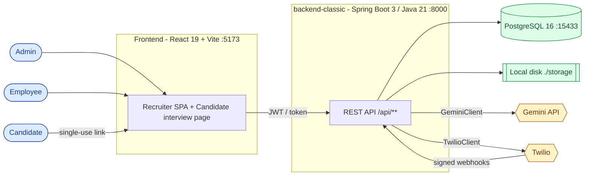
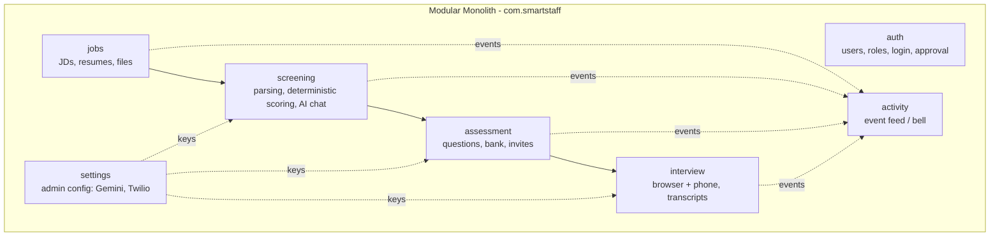
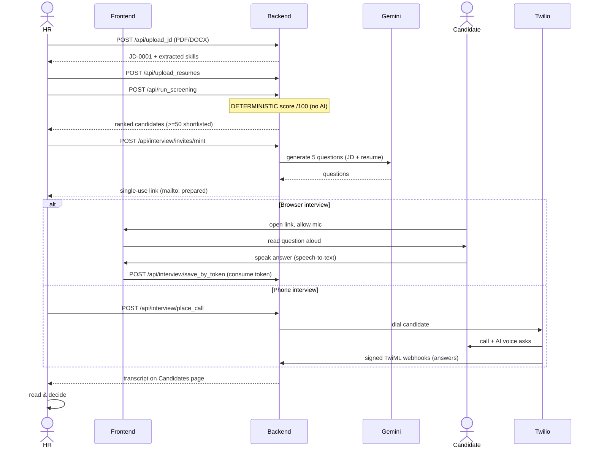
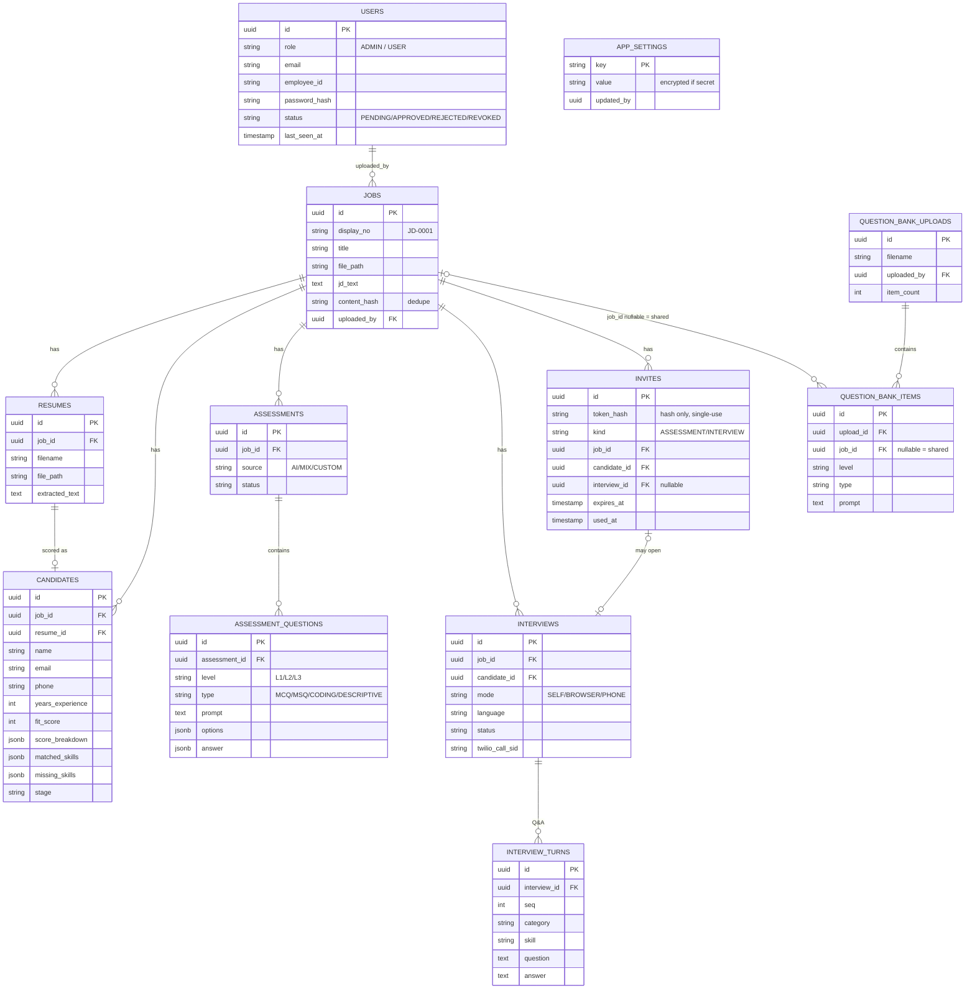

# SmartStaff — Architecture & ER Diagrams

Mermaid diagrams for onboarding. Paste any block into the Mermaid Live Editor
(https://mermaid.live) or view in any Markdown renderer that supports Mermaid.

Companion to [ONBOARDING.md](ONBOARDING.md).

---

## 1. System context (who talks to what)



---

## 2. Layered request path (the shape every feature follows)

```mermaid
flowchart TD
    req[HTTP request] --> filter

    subgraph filters[filter + security]
        filter[RequestIdFilter -> RateLimitFilter] --> jwt[JwtAuthFilter\nresolve token to User]
    end

    jwt --> ctrl[controller/\nvalidate @Valid DTO, call ONE service method]
    ctrl --> svc[service/ interface]
    svc --> impl[service/impl/\nBUSINESS LOGIC]
    impl --> repo[repository/\nSpring Data JPA]
    repo --> ent[entity/ @Entity]
    ent --> repo
    repo --> impl
    impl --> mapper[mapper/\nentity -> response DTO]
    mapper --> resp[DTO response]

    impl -.->|external calls only| client[client/\nGeminiClient / TwilioClient]
    impl -.->|helpers| util[util/\nTika, SkillDictionary, Crypto, FileStorage]
    impl -.->|throws ApiException| gh[GlobalExceptionHandler\n-> {ok:false, message, code}]

    classDef biz fill:#ede9fe,stroke:#6d28d9,color:#4c1d95;
    class impl,svc biz;
```

---

## 3. Modules (feature map)



---

## 4. End-to-end hiring flow (sequence)



---

## 5. Entity-Relationship diagram (data model)


